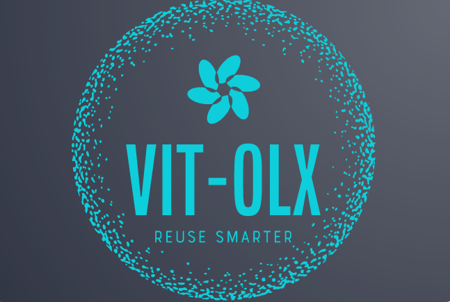

[![Contributors][contributors-shield]][contributors-url]
[![Forks][forks-shield]][forks-url]
[![Stargazers][stars-shield]][stars-url]
[![Issues][issues-shield]][issues-url]
[![MIT License][license-shield]][license-url]
[![LinkedIn][linkedin-shield]][linkedin-url]


<!-- PROJECT LOGO -->
<br />
<p align="center">
  <a href="https://github.com/abhishekkushwaha4u/vitolx-backend">
    
  </a>

  <h3 align="center">VIT OLX Backend</h3>

  <p align="center">
    The Backend Code Starter to setup OLX for your own organization !
    <br />
    <a href="https://documenter.getpostman.com/view/7132402/TzY68Zax"><strong>Explore the docs »</strong></a>
    <br />
    <br />
    <a href="https://github.com/abhishekkushwaha4u/vitolx-backend/issues">Report Bug</a>
    ·
    <a href="https://github.com/abhishekkushwaha4u/vitolx-backend/issues">Request Feature</a>
  </p>
</p>


<!-- TABLE OF CONTENTS -->
<details open="open">
  <summary>Table of Contents</summary>
  <ol>
    <li>
      <a href="#about-the-project">About The Project</a>
      <ul>
        <li><a href="#built-with">Built With</a></li>
      </ul>
    </li>
    <li>
      <a href="#getting-started">Getting Started</a>
      <ul>
        <li><a href="#prerequisites">Prerequisites</a></li>
        <li><a href="#installation">Installation</a></li>
      </ul>
    </li>
    <li><a href="#usage">Usage</a></li>
    <li><a href="#roadmap">Roadmap</a></li>
    <li><a href="#contributing">Contributing</a></li>
    <li><a href="#license">License</a></li>
    <li><a href="#contact">Contact</a></li>
  </ol>
</details>


<!-- ABOUT THE PROJECT -->
## About The Project


This was an idea that me and my friend [Shounak Bhattacharya](https://www.linkedin.com/in/shounak-bhattacharya-8585ba1b4/) decided to work on for our IWP J component under the able guidance of our IWP mam, [Professor Malathy E](https://research.vit.ac.in/researcher/malathy-e), Assistant Professor, in F2 slot.

Here's why some reasons we wanted to work on something like this:
* With COVID almost getting over, we are expecting everyone back on campus, hence freshers and all new people to populate soon.
* The scene is vastly different for people in final year and freshers, final years are mostly about to pass out and mostly with no intention of retaining items like pillows, mattrices, books etc
* On the other hand, frehers are in dire need of these resources as a lot of them need them all that once, but the shops at Vellore are unable to supply and meet the demand quickly, mostly students end up suffering because of lack of these basic amenities at college.

Our idea was to build a small web application to enable people to allow exchange of these items in a community friendly way, hence solving this simple problem.

### Built With

* [Django](https://www.djangoproject.com/)
* [Python](https://www.python.org/)
* [Telegram Bot API](https://telegram.org/blog/bot-revolution)


### Setting Up VirtualEnvironment(Follow this in case you are new)

* virtualenv - Setting up the virtual environment
  ```sh
  virtualenv env
  ```
* virtualenv activation - Activating of the virtual environment
  ```sh
  source env/bin/activate # Linux and Mac OS
  ```
  ```powershell
  .\env\Scripts\activate # Windows
  ```

<!-- GETTING STARTED -->
## Getting Started

This is an example of how you may give instructions on setting up your project locally.
To get a local copy up and running follow these simple example steps.

### Prerequisites

You need to have Python 3.6+ installed on your system and added to path. In case you do not have python installed, you can follow [this](https://medium.com/analytics-vidhya/step-by-step-guide-to-install-python-environment-on-ubuntu-337d8dbdd05d) to set python up for your system.

### ERD Model

This is the ER diagram of the models we used in Django for building this project. In case you need to generate one for your own, run the `er_generator.sh` (Runs on linux only right now, and needs graphviz as a dependency)

![ER Diagram][product-screenshot]


### Installation

1. Download the frontend repo from [here](https://github.com/Shounak-bhattacharya/VIT-OLX
)
2. Clone this repo
   ```sh
   git clone https://github.com/abhishekkushwaha4u/vitolx-backend
   ```
3. Setup and activate a virtualenvironment(Described Above)
4. Install pip packages
   ```sh
   pip install -r requirements.txt
   ```
5. To setup migrations(Do this after changing your database creds or use sqlite by default)
   ```sh
   python manage.py makemigrations
   python manage.py migrate
   ```
6. To run the server, type 
   ```sh
   python manage.py runserver
   ```

7. To setup the telegram script, launch another terminal/cmd and activate the same virtual environment

8. Navigate to `telegram_bot` with 
   ```sh
   cd telegram_bot
   ```
9. Start the bot with
   ```sh
   python run_bot.py
   ```

Your can serve the frontend code on any localserver and use it easily integrated with your backend on localhost.

Note: Please configure the .env before running all these projects.
You can use the values provided in .env for both the telegram part and the server part.
Please configure the telegram bot token before starting the server.

In order to obtain a token for yourself, follow [this](https://medium.com/shibinco/create-a-telegram-bot-using-botfather-and-get-the-api-token-900ba00e0f39) article.

***Note: This project has a lot of configurational settings left untouched in `vitolx/settings.py`, please make sure to change the `secret key` and other dummy exposed secrets(like `database credentials`, etc) before running in a sensitive environment!***

<!-- USAGE EXAMPLES -->
## Usage

_For more examples on the api endpoints, please refer to the [Documentation](https://documenter.getpostman.com/view/7132402/TzY68Zax)_

_For using the telegram script, search for your bot in telegram and press `start`. It will ask you to setup your notification id, once you are done, you can get updates whenever someone wants to communicate with you on that part on telegram._

<!-- ROADMAP -->
## Roadmap

See the [open issues](https://github.com/abhishekkushwaha4u/vitolx-backend/issues) for a list of proposed features (and known issues).


<!-- CONTRIBUTING -->
## Contributing

Contributions are what make the open source community such an amazing place to be learn, inspire, and create. Any contributions you make are **greatly appreciated**.

1. Fork the Project
2. Create your Feature Branch (`git checkout -b feature/AmazingFeature`)
3. Commit your Changes (`git commit -m 'Add some AmazingFeature'`)
4. Push to the Branch (`git push origin feature/AmazingFeature`)
5. Open a Pull Request


<!-- LICENSE -->
## License

Distributed under the MIT License. See `LICENSE` for more information.


<!-- CONTACT -->
## Contact

Abhishek Kushwaha- [@itsAbhi1706](https://twitter.com/itsAbhi1706) - abhi1234@mail.com

Backend Repo Link: [Backend Repo](https://github.com/abhishekkushwaha4u/vitolx-backend)

FrontEnd Repo Link: [Fronted Repo](https://github.com/Shounak-bhattacharya/VIT-OLX
)


<!-- MARKDOWN LINKS & IMAGES -->
<!-- https://www.markdownguide.org/basic-syntax/#reference-style-links -->
[contributors-shield]: https://img.shields.io/github/contributors/abhishekkushwaha4u/vitolx-backend?style=for-the-badge
[contributors-url]: https://github.com/abhishekkushwaha4u/vitolx-backend/graphs/contributors
[forks-shield]: https://img.shields.io/github/forks/abhishekkushwaha4u/vitolx-backend.svg?style=for-the-badge
[forks-url]: https://github.com/abhishekkushwaha4u/vitolx-backend/network/members
[stars-shield]: https://img.shields.io/github/stars/abhishekkushwaha4u/vitolx-backend.svg?style=for-the-badge
[stars-url]: https://github.com/abhishekkushwaha4u/vitolx-backend/stargazers
[issues-shield]: https://img.shields.io/github/issues/abhishekkushwaha4u/vitolx-backend.svg?style=for-the-badge
[issues-url]: https://github.com/othneildrew/Best-README-Template/issues
[license-shield]: https://camo.githubusercontent.com/111148992d0253f8d5e36b62087d48a9eabb1d7244b2b7316214f47d5c9a8781/68747470733a2f2f696d672e736869656c64732e696f2f6769746875622f6c6963656e73652f6f74686e65696c647265772f426573742d524541444d452d54656d706c6174652e7376673f7374796c653d666f722d7468652d6261646765
[license-url]: https://github.com/abhishekkushwaha4u/vitolx-backend/blob/master/LICENSE
[linkedin-shield]: https://img.shields.io/badge/-LinkedIn-black.svg?style=for-the-badge&logo=linkedin&colorB=555
[linkedin-url]: https://www.linkedin.com/in/abhishek-kushwaha-b04341194/
[product-screenshot]: er_diagram.png
